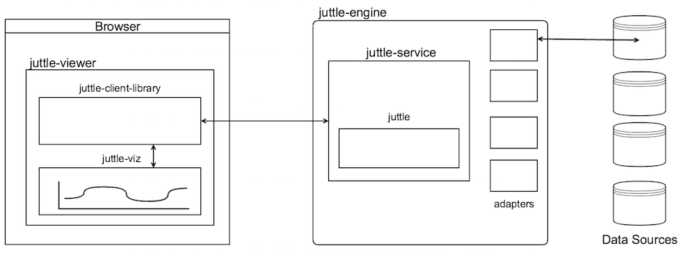

# Juttle

[](https://travis-ci.org/juttle/juttle)
[](https://gitter.im/juttle/juttle?utm_source=badge&utm_medium=badge&utm_campaign=pr-badge&utm_content=badge)

Juttle is an analytics system for developers that simplifies and empowers data
driven application development. At the core of Juttle is a [dataflow
language](./docs/concepts/dataflow.md) that lets you query, transform, enrich,
and analyze live and historical data from many different backends, and then send
output to files, data stores, alerting systems, or [streaming
visualizations](http://github.com/juttle/juttle-viz).

This repository contains the core Juttle compiler, the Javascript runtime, a set
of basic adapters to connect to files or http sources, and a command line
interface with text-based and tabular views. As such it is most useful for
learning the language, doing simple exploration of data, or powering periodic
transformations or running periodic or continuous programs that generate alerts to an external system.

For a more complete package demonstrating the full spectrum of Juttle's
capabilities, the [Juttle Engine](https://github.com/juttle/juttle-engine)
project embeds the juttle core in a REST API based [execution
service](https://github.com/juttle/juttle-service) along with a [viewer
application](https://github.com/juttle/juttle-viewer) and a full set of
[supported adapters](#adapters). This assembly can be used to run Juttle
programs with rich charts and dynamic input controls in development or
production.

To learn more, see the [documentation site](https://juttle.github.io/juttle) to read about why juttle exists,
get an [overview](https://juttle.github.io/juttle/concepts/overview) of the language, learn about the
[dataflow features](https://juttle.github.io/juttle/concepts/dataflow) and how to [program in juttle](https://juttle.github.io/juttle/concepts/programming_constructs), see the list of [supported visualizations](https://juttle.github.io/juttle-viz), and more. For information about the Juttle development project, see the [wiki](https://github.com/juttle/juttle/wiki).

## Installation

Juttle requires [node.js](https://nodejs.org/) version 4.2 or later.

To use Juttle as a command-line tool, the simplest approach is to install the juttle package globally:

```
$ npm install -g juttle
```

To use the full Juttle Engine assembly, run:

```
$ npm install -g juttle-engine
```

In both cases you should now have a `juttle` executable in your path which you can use as follows:

```
$ juttle -e "emit -limit 2 | put message='hello'"
```

This produces:

```
┌────────────────────────────────────┬───────────┐
│ time                               │ message   │
├────────────────────────────────────┼───────────┤
│ 2015-12-18T21:04:52.322Z           │ hello     │
├────────────────────────────────────┼───────────┤
│ 2015-12-18T21:04:53.322Z           │ hello     │
└────────────────────────────────────┴───────────┘
```

For detailed usage, see the [command line reference](./docs/reference/cli.md) for more information about how to configure and use the Juttle CLI.
See the [Juttle Engine README](https://github.com/juttle/juttle-engine/blob/master/README.md) for command line options and configuration instructions.

## Examples

Here are some more examples of what you can do with Juttle.

Note that most of these examples require the use of external systems using [adapters](#adapters) and refer to the visualizations embedded in Juttle Engine, so they are meant to be illustrative and not necessarily functional out of the box.

For runnable end-to-end examples of juttle usage, see the [Juttle Engine examples](https://github.com/juttle/juttle-engine/tree/master/examples).

### Hello world

Hello world in Juttle:

```juttle
emit -every :1 second: -limit 10 | put message='hello world' | view table
```

### Error events on a timeseries graph

This example prompts a user to input a time range to query, pulls a timeseries
metric of counts of user signups from graphite, searches for 100 logs from
Elasticsearch in which the app field is 'login' and the string 'error' occurs,
and then plots the metric along with overlaid events on the same timechart along
with a table showing the errors themselves.

```javascript
input time_period: duration -label 'Time period to query' -default :5 minutes:;

read graphite -last time_period name~'app.login.*.signup.count'
| view timechart -title 'User Signups' -id 'signup_chart';

read elastic -last time_period app='login' 'errors'
| head 100
| (
    view table -title 'Errors';
    view events -on 'signup_chart'
  )
```

### Real-time slack alerting from twitter events

This example taps into the stream of real-time twitter events searching for 'apple' and printing them to a table. If more than 10 posts occur in a five second window, it posts a message to a slack webhook.

```juttle
read twitter -from :now: -to :end: 'apple'
| (
    view table -title 'Tweets about apple';

    reduce -every :5 seconds: value=count()
    | filter value > 10
    | put message='apple is trending'
    | write http -maxLength 1 -url 'https://hooks.slack.com/services/ABCDEF12345/BB8739872984/BADF00DFEEDDAB'
  )
```

<a name="adapters"></a>

## Ecosystem

Here's how the juttle module fits into the overall [Juttle Ecosystem](./docs/juttle_ecosystem.md):

[](./docs/juttle_ecosystem.md)


## Adapters

Juttle includes support for a few basic [adapters](./docs/adapters/index.md)
out of the box to interact with files and some external systems. In addition,
through the external adapter API, Juttle can be easily extended to interact with
other storage systems or services.

#### Builtin

These adapters can be used in Juttle programs directly without special
configuration.

* [file](./docs/adapters/file.md)
* [http](./docs/adapters/http.md)
* [http_server](./docs/adapters/http_server.md)
* [stdio](./docs/adapters/stdio.md)
* [stochastic](./docs/adapters/stochastic.md)

#### External

This is a list of the currently supported external adapters.

All are included as part of a Juttle Engine installation. If you've installed
the standalone juttle CLI, you will need to separately install them using npm
and make sure to install them in the same location as juttle itself.

* [Elasticsearch](https://github.com/juttle/juttle-elastic-adapter/)
* [Graphite](https://github.com/juttle/juttle-graphite-adapter/)
* [InfluxDB](https://github.com/juttle/juttle-influx-adapter/)
* [SQLite](https://github.com/juttle/juttle-sqlite-adapter/)
* [PostgreSQL](https://github.com/juttle/juttle-postgres-adapter/)
* [MySQL](https://github.com/juttle/juttle-mysql-adapter/)
* [Twitter](https://github.com/juttle/juttle-twitter-adapter/)
* [Gmail](https://github.com/juttle/juttle-gmail-adapter/)
* [OpenTSDB](https://github.com/juttle/juttle-opentsdb-adapter/)
* [AWS (Amazon Web Services)](https://github.com/juttle/juttle-aws-adapter/)
* [Amazon CloudWatch](https://github.com/juttle/juttle-cloudwatch-adapter/)

Connections to external adapters are configured in the "adapters" section of the runtime configuration. See the [CLI reference](./docs/reference/cli.md) for specific instructions.

## Contributing

Contributions are welcome! Please file an issue or open a pull request.

To check code style and run unit tests:
```
npm test
```

Both are run automatically by Travis.

When developing you may run into failures during linting where eslint complains
about your coding style and an easy way to fix those files is to simply run
`eslint --fix test` or `eslint --fix lib` from the root directory of the project.
After eslint fixes things you should proceed to check that those changes are
reasonable as auto-fixing may not produce the nicest of looking code.
